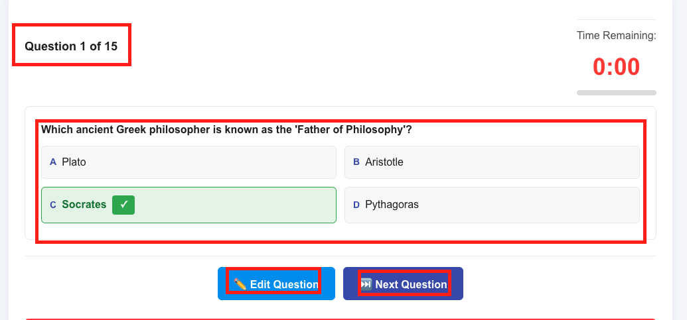
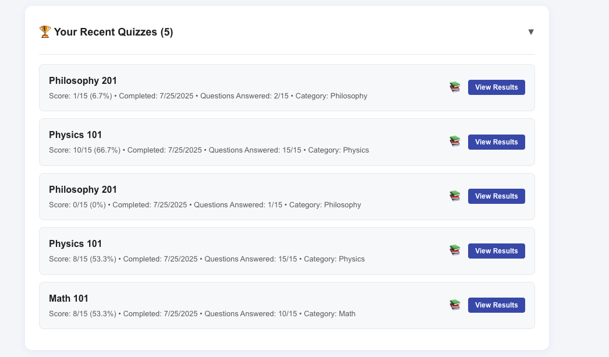
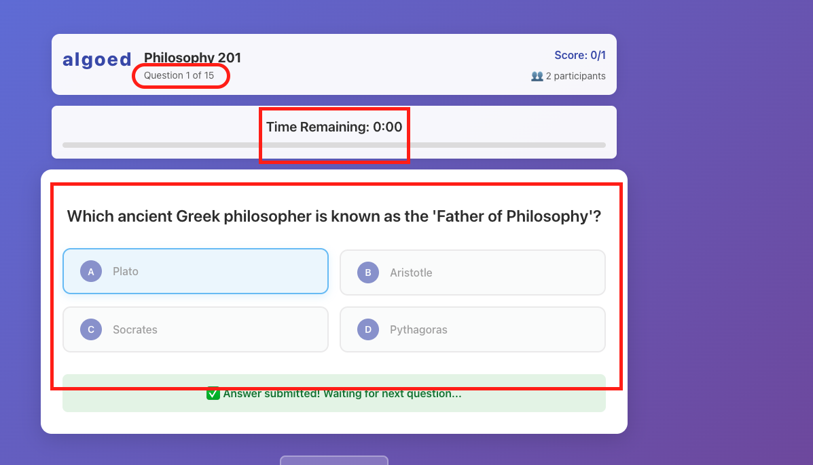
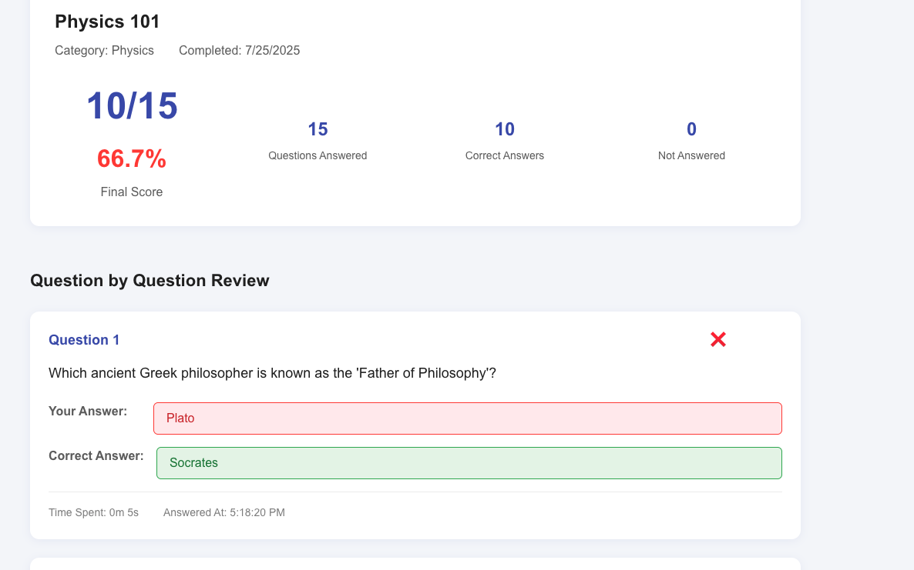

# Live Quiz Competition MVP

A real-time quiz competition platform built with React.js and Firebase, supporting synchronized live quiz sessions with anti-cheating measures and comprehensive admin controls. 

The highlights of the implementation is we persist all the data user interacts with quizzes, every quiz competition is recorded and stored on Firebase, so users can go to their dashboard, *view results*, improve the scores. In addition, we also provide functionalties for admin to *upload quizzes* in json format, during the quiz competition, we provide an easy way for admin to *update the quiz in real-time, and locks the participant during the edit*, the edited version is also stored on firebase via async thread. We also send the students result even student leaves the session in the middle of the competition or lost the connection. 

## 🚀 Features

- **Real-time Live Quiz Sessions**: Synchronized quiz competition where multiple students take the quiz simultaneously
- **Admin Dashboard**: Create, manage, and monitor quiz sessions with live participant tracking
- **Student Portal**: Join live sessions, take quizzes, and view detailed results
- **Live Editing**: Admins can edit questions during active sessions with participant locking
- **Real-time Presence**: Heartbeat system tracks active participants
- **Comprehensive Results**: Detailed answer review with correct/incorrect/unanswered tracking
- **Responsive Design**: Mobile-friendly interface that adapts to different screen sizes

## 🛠️ Setup Instructions

### Prerequisites

- Node.js (version 18 or higher)
- npm or yarn package manager
- Firebase account

### 1. Clone the Repository

```bash
git clone [repository-url]
cd algo_ed_takehome
```

### 2. Install Dependencies

```bash
npm install
```

### 3. Firebase Configuration

The project includes a pre-configured Firebase setup. You can use the existing `src/firebase.js` file without any additional configuration needed.

### 4. Start Development Server

```bash
npm run dev
```

The application will be available at `http://localhost:5173` (or another port if 5173 is in use).


## 📋 User Flows

### Admin Flow

1. **Login/Registration**: Admin creates an account or logs in
2. **Dashboard Access**: View all created quizzes with filtering by category
3. **Quiz Creation**: Upload JSON file with questions and publish
4. **Live Session Start**: Click "Start Live Quiz" to create a session with unique code
5. **Session Management**: 
   - Monitor participants joining
   - Start the quiz when ready
   - **Admin Live Quiz Page**: Real-time session control interface featuring:
     - Current question display with multiple choice options (2 per line)
     - Question navigation controls (Edit, Next Question, End Session)
     - Live participant list with real-time scores
     - Admin countdown timer for question time limits
     - Real-time question editing with participant locking
     - Session status monitoring (waiting/active/editing/completed)
   
   
   
   - Navigate through questions with timer
   - Edit questions in real-time (locks student interfaces)
   - View live participant scores
   - End session when complete
6. **Results Review**: Access detailed session analytics

### Student Flow

1. **Login/Registration**: Student creates account with email verification
2. **Dashboard**: View recent quiz results and discover new quizzes
   
3. **Join Live Session**: 
   - Enter session code from admin, we assume that there's a reservation mechanism which allows participants to recive code generated from adminPage when session starts. 
   - After entering the code, users are expected to wait in lobby until admin starts the session.
4. **Take Quiz**:
   - Answer questions within time limit
   - See real-time feedback when admin edits questions
   - Submit answers or have them auto-submitted on timeout
   
5. **View Results**: 
   - See final score and detailed question review
   - Compare performance with correct answers
   - Access results from dashboard for future reference
   

### Session States

- **Waiting**: Session created, participants can join
- **Active**: Quiz in progress, participants answering questions
- **Editing**: Admin editing a question, participants locked
- **Completed**: All questions finished, results available

## 🏗️ Design Decisions

### Architecture

- **Frontend**: React.js with functional components and hooks
- **Backend**: Firebase Firestore for real-time data synchronization
- **Authentication**: Firebase Auth with email/password and Google OAuth
- **Styling**: CSS-in-JS with responsive design principles

### Real-time Implementation

- **Firestore Listeners**: Used `onSnapshot` for real-time updates
- **Heartbeat System**: Custom `QuizPresenceManager` tracks active users
- **Session Management**: Central `LiveQuizManager` utility handles all live quiz operations

### Data Model

```
liveQuizSessions/
├── sessionId: string
├── quizId: string
├── adminId: string
├── sessionCode: string (6-digit)
├── status: 'waiting' | 'active' | 'editing' | 'completed'
├── currentQuestionIndex: number
├── shuffledQuestions: Array<Question>
├── totalQuestions: number
├── participants: Array<userId>
├── questionStartTime: timestamp
├── isEditing: boolean

liveParticipants/
├── sessionId_userId: string
├── sessionId: string
├── userId: string
├── userName: string
├── joinedAt: timestamp
├── lastSeen: timestamp
├── isActive: boolean

liveQuizResults/
├── sessionId: string
├── userId: string
├── quizId: string
├── answers: Array<AnswerRecord>
├── currentScore: number
├── questionsAnswered: number
├── completedAt: timestamp
```

### UI/UX Principles

- **Mobile-First**: Responsive design works on all screen sizes
- **Consistent Styling**: Unified color scheme and typography
- **Real-time Feedback**: Immediate visual updates for all state changes
- **Accessibility**: Clear navigation and readable interface
- **Performance**: Optimized for real-time updates without lag

## 🔮 Future Enhancements

1. **Enhanced Analytics**
   - Detailed question performance metrics
   - Session completion rates
   - Time-per-question analysis
   - Participant engagement tracking

2. **Advanced Admin Features**
   - Bulk quiz import/export
   - Question bank management
   - Template quiz creation
   - Scheduled quiz sessions

3. **Student Experience**
   - Quiz recommendations based on performance
   - Achievement badges and progress tracking
   - Leaderboards and competition rankings
   - Study mode for practice


4. **Advanced Question Types**
   - Multiple correct answers
   - Image and video questions
   - Fill-in-the-blank
   - Drag-and-drop ordering


5. **AI-Powered Features**
   - Automatic question generation
   - Difficulty adaptation based on performance
   - Plagiarism detection
   - Smart content recommendations
   - Personalized recommendation for quizzes 


6. **Scalability Enhancements**
   - Multi-region deployment
   - CDN integration for global performance
   - Advanced caching strategies
   - Database sharding for large-scale usage

7. **Enterprise Features**
   - Multi-tenant architecture
   - Custom branding options
   - Advanced reporting and exports
   - SCORM compliance for e-learning

## 🧪 Testing Strategy

- **Unit Tests**: Component testing with Jest and React Testing Library
- **Integration Tests**: Firebase integration and real-time functionality
- **E2E Tests**: Complete user journey testing with Cypress
- **Performance Tests**: Load testing for concurrent sessions
- **Security Tests**: Authentication and authorization validation

## 📊 Performance Considerations

- **Firestore Optimization**: Efficient queries and indexing strategy
- **Real-time Limits**: Batched updates to prevent rate limiting
- **Memory Management**: Proper cleanup of listeners and subscriptions
- **Caching Strategy**: Local storage for immediate feedback
- **Bundle Optimization**: Code splitting and lazy loading

## 🔒 Security Features

- **Authentication**: Multi-factor authentication support
- **Authorization**: Role-based access control
- **Data Validation**: Client and server-side input validation
- **Secure Communication**: HTTPS enforcement
- **Privacy Protection**: GDPR compliance considerations

